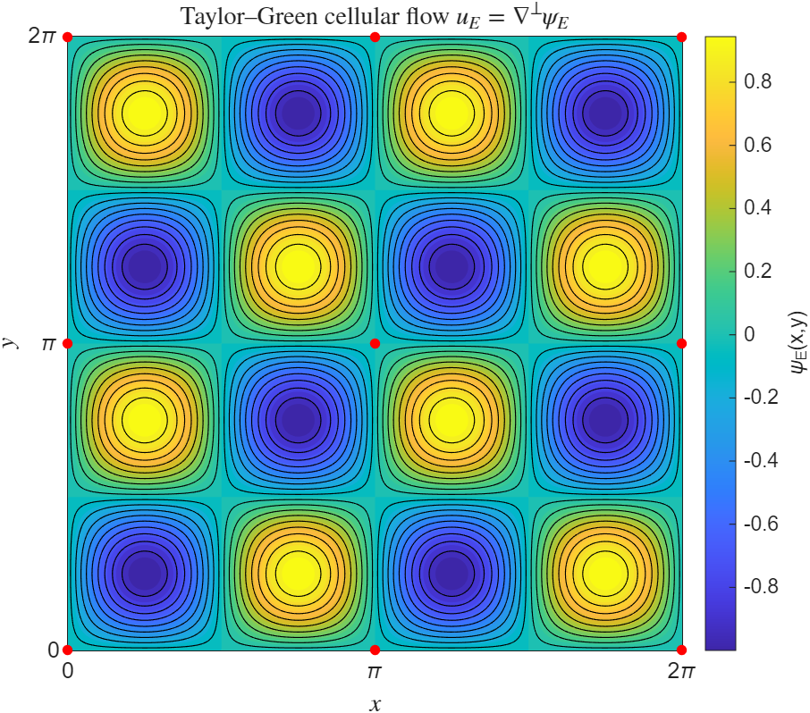
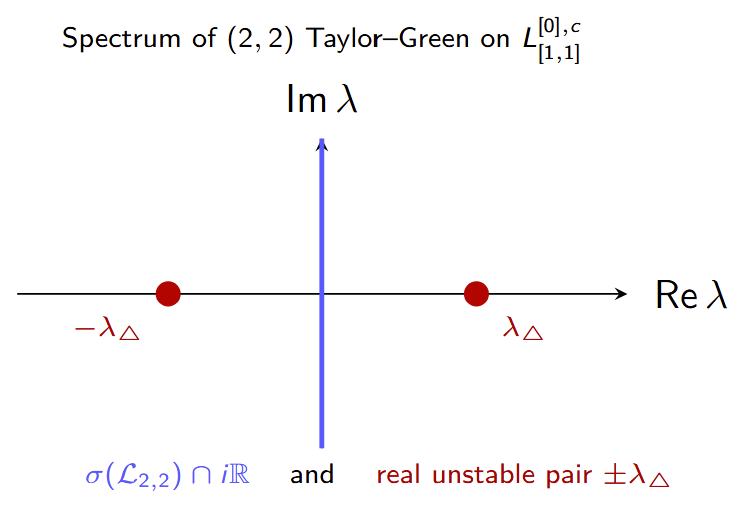

# Real Spectral Instability of the (2,2) Taylor–Green Vortex

<p align="center">
  
</p>

<p align="center">
  <em>The (2,2) Taylor–Green cellular flow on the two-dimensional torus.</em>
</p>

## Overview

This repository collects the mathematical report, presentation, figures, and exploratory MATLAB scripts produced during my **Spring 2026 semester project in the AMCV department at EPFL university**.

The project was carried out by **Stefano Bernasconi**, under the supervision of **Prof. Maria Colombo**, with **Dr. Gonzalo Cao-Labora** as co-supervisor.

The work concerns the spectral stability of steady solutions of the two-dimensional incompressible Euler equations on the torus. Its starting point is the recent instability theory developed by Cao-Labora, Colombo, Dolce, and Ventura for linear Hamiltonian operators. After studying and reconstructing the main ideas of that work, we developed a novel criterion that characterizes the spectrum of rank-one invariant blocks of the Linearised Euler operator; finally we applied our result to the $(2,2)$ Taylor–Green vortex to prove the existence of a real unstable eigenvalue.

## Mathematical setting

On the two-dimensional torus

$$
\mathbb{T}^2 = \mathbb{R}^2/(2\pi\mathbb{Z})^2,
$$

the incompressible Euler equations in vorticity form are

$$
\partial_t\omega + u\cdot\nabla\omega = 0,
\qquad
u = \nabla^\perp\psi,
\qquad
\Delta\psi = \omega.
$$

The generalized Taylor–Green equilibria are defined by

$$
\psi_{m,n}(x,y) = -\sin(mx)\sin(ny),
\qquad
\omega_{m,n} = \Delta\psi_{m,n}.
$$

Linearization around such an equilibrium gives a Hamiltonian operator

$$
\mathcal{L}_{m,n} = \mathcal{J}_{m,n}\mathcal{H}_{m,n},
$$

where

$$
\mathcal{J}_{m,n} = -\{\psi_{m,n},\cdot\},
\qquad
\mathcal{H}_{m,n} = \mathrm{Id} + (m^2+n^2)\Delta^{-1}.
$$

The central question is whether $\mathcal{L}_{m,n}$ possesses eigenvalues with positive real part.

## Background and preliminary work

The theoretical foundation of this project is:

> G. Cao-Labora, M. Colombo, M. Dolce, and P. Ventura,  
> **“Instability of Two-Dimensional Taylor–Green Vortices,”**  
> arXiv:2601.23040, 2026.

The paper introduces a finite-dimensional criterion for detecting unstable eigenvalues of a broad class of Hamiltonian operators. For a suitable splitting

$$
\mathcal{H} = \mathcal{H}_s + \mathcal{H}_u,
$$

the unstable spectrum of the infinite-dimensional operator $\mathcal{L} = \mathcal{J}\mathcal{H}$ is encoded by the zeros of a finite-dimensional holomorphic determinant

$$
\Phi(\lambda) = \det M_\lambda.
$$

This framework is used in the original work to analyze the classical Taylor–Green vortex and to study the broader family of $(m,n)$ Taylor–Green flows.

## Contribution of the semester project

The project had two main components.

### 1. Reconstruction of the original theory

The first part develops a self-contained presentation of:

- the 2D Euler equations on the torus;
- linearization around Taylor–Green equilibria;
- the Hamiltonian factorization $\mathcal{L} = \mathcal{J}\mathcal{H}$;
- the role of the negative directions of $\mathcal{H}$;
- the reduction of the unstable spectral problem to a finite-dimensional determinant;
- the invariant-subspace and symmetry decompositions used for Taylor–Green vortices.

### 2. A new rank-one instability result

Working together with Dr. Cao-Labora, we derived a new criterion for a rank-one Hamiltonian block. In this setting, the existence of a negative-energy direction in

$$
(\ker\mathcal{J})^\perp
$$

forces the appearance of a purely real unstable eigenvalue.

We then applied this tool to a symmetry-reduced invariant block of the $(2,2)$ Taylor–Green operator. This yields a real unstable pair

$$
\{\lambda_\triangle,-\lambda_\triangle\},
\qquad
\lambda_\triangle > 0,
$$

inside the block. Symmetry transfers the same pair to the related invariant components; in the full space, the two real eigenvalues occur with the corresponding symmetry-induced multiplicity.

<p align="center">
  
</p>

<p align="center">
  <em>Schematic spectrum of the unstable invariant block: the instability is purely real.</em>
</p>

This result is distinct from the complex unstable eigenvalues obtained by rescaling the instability of the $(1,1)$ vortex. It reveals an additional real instability mechanism specific to the finer invariant-block structure of the $(2,2)$ flow.

## Current status

The new mathematical result obtained during this project is **currently being developed into a research manuscript**. The report and code in this repository document the semester-project stage of the work and should not be treated as the final version of the forthcoming paper.

## Repository structure

```text
.
├── README.md
├── figures/
│   ├── taylor_green_22_vortex.png
│   └── taylor_green_22_real_unstable_spectrum.png
├── matlab/
│   ├── README.md
│   ├── TaylorGreen_flow_visualization.m
│   ├── Energy_calculator.m
│   └── L110c_calculation_of_energy.m
├── report/
│   └── semester_project_report.pdf
└── slides/
    └── semester_project_presentation.pdf
```

## Contents

- **[`report/semester_project_report.pdf`](report/semester_project_report.pdf)**  
  Complete semester-project report, including the theoretical background and the new $(2,2)$ instability argument.

- **[`slides/semester_project_presentation.pdf`](slides/semester_project_presentation.pdf)**  
  Slides used for the final presentation of the project.

- **[`matlab/TaylorGreen_flow_visualization.m`](matlab/TaylorGreen_flow_visualization.m)**  
  Visualization of the $(2,2)$ Taylor–Green stream function, streamlines, velocity field, and stagnation points.

- **[`matlab/README.md`](matlab/README.md)**  
  Detailed mathematical and computational documentation for the MATLAB scripts, including the explicit negative-energy construction in the invariant block $L^2_0(\mathbb{T}^2)^{[0],c}_{[1,1]}$.

- **[`matlab/Energy_calculator.m`](matlab/Energy_calculator.m)** and **[`matlab/L110c_calculation_of_energy.m`](matlab/L110c_calculation_of_energy.m)**  
  Fourier-mode computations used to construct and test vectors in $(\ker\mathcal{J}_{2,2})^\perp$ and evaluate their Hamiltonian energy.

## Citation

When referring to the preliminary theory on which this project is based, please cite the original paper:

```bibtex
@article{CaoLaboraColomboDolceVentura2026,
  author        = {Cao-Labora, Gonzalo and Colombo, Maria and
                   Dolce, Michele and Ventura, Paolo},
  title         = {Instability of Two-Dimensional Taylor--Green Vortices},
  year          = {2026},
  eprint        = {2601.23040},
  archivePrefix = {arXiv},
  primaryClass  = {math.AP}
}
```

For the new $(2,2)$ result, please refer to the future research manuscript once it becomes publicly available.

## Acknowledgements

I am grateful to **Maria Colombo** for supervising this semester project and to **Gonzalo Cao-Labora** for his experienced guidance, close collaboration, discussions, and joint development of the new instability argument.

## License and reuse

No reuse license is assigned at this stage. The licensing terms for the report, figures, and code will be specified before public release, in agreement with the supervisors and any future manuscript.
